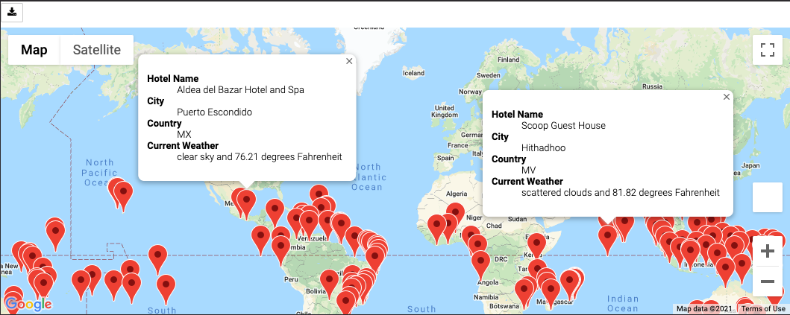
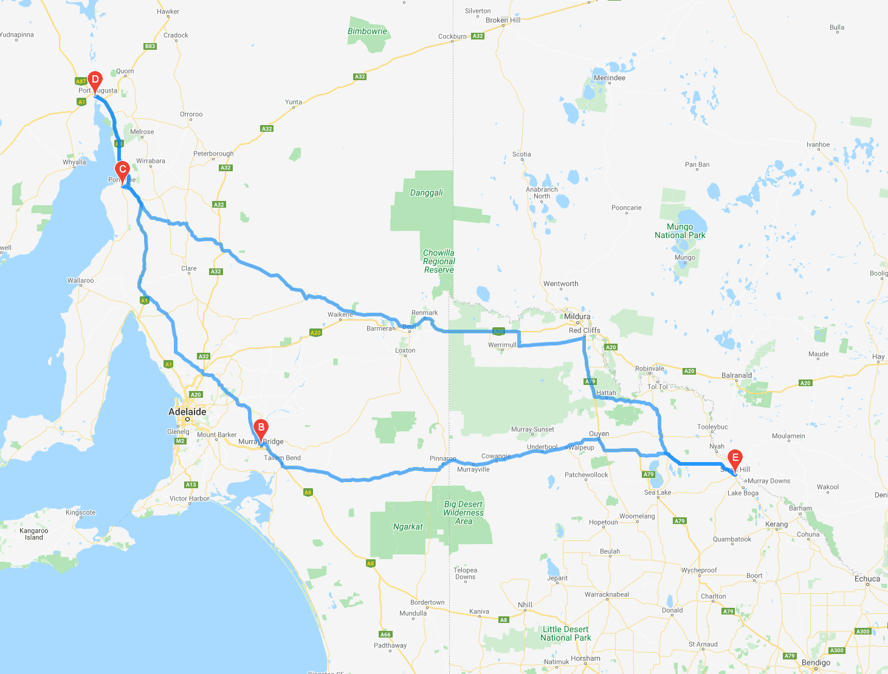
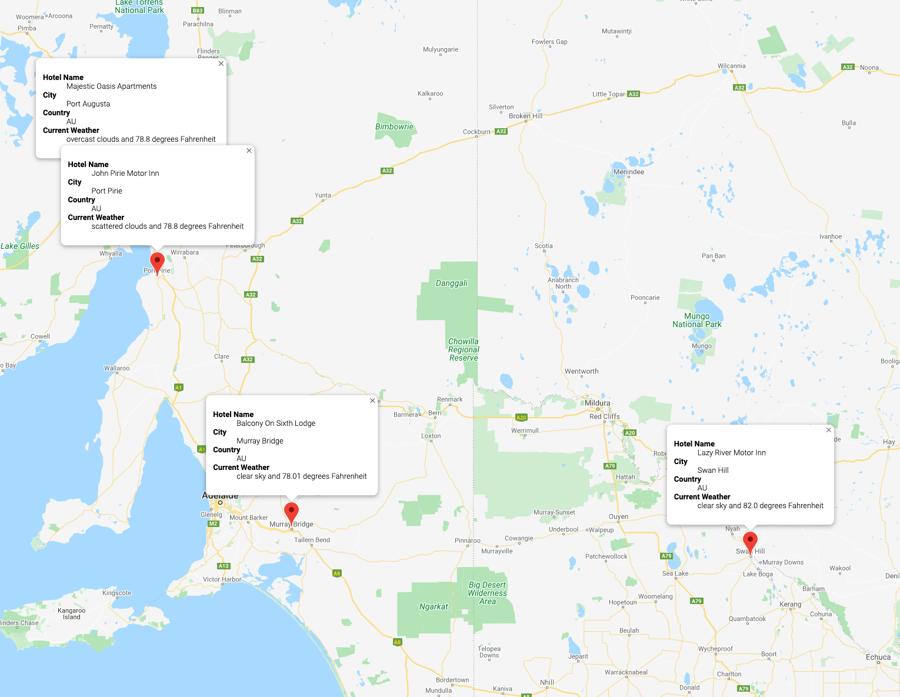

# World Weather Analysis

## Overview of Project

### Purpose

The objective of this project was to use API calls from OpenWeatherMap and Google Map Platforms to pull weather data from random latitude and longitude pairs and plan a trip through 4 cities that met our weather criteria.

## Project Analysis

### Deliverable 1

We generated a random set of 2,000 latitude and longitude pairs. Using the `citipy` module we grabbed the city closest to these coordinates. We performed API calls from OpenWeatherMap and retrieved the following data for each city:
- Latitude and longitude
- Maximum Temperature
- Percent Humidity
- Percent Cloudiness
- Wind Speed
- Weather Description

We added this data to a DataFrame and exported to a CSV for future use.

### Deliverable 2

After importing our previously created "WeatherPy_Database.csv", we prompted the user to give us maximum and minimum temperature requirements in order to identify potential vacation locations. We used 
`clean_df = city_data_df.loc[(city_data_df["Max Temp"] <= max_temp) & (city_data_df["Max Temp"] >= min_temp)]` in order to create a new DataFrame that met the inputted criteria. With our cleaned DataFrame we used Google APIs to find the nearest hotel to our city coordinates. Using the `gmaps` module we were able to post markers at all the hotels we identified:

### Deliverable 3

Using our 

## Summary

### Recommendations